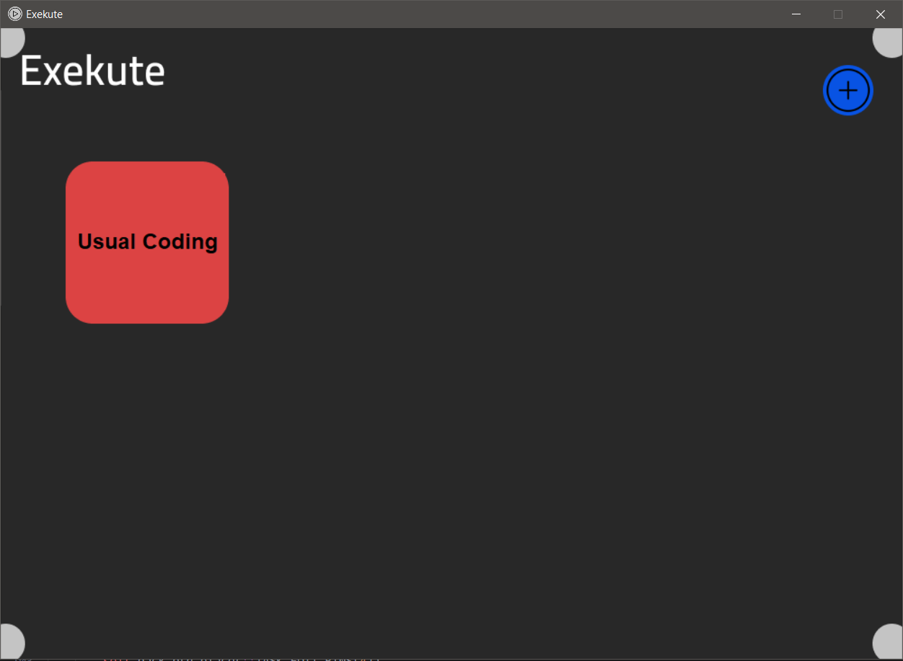

# Exekute


A Tkinter app to start all you daily routine apps with one click.


# 🔻Installation

## 👩‍💻From Source.
```commandline
git clone https://github.com/Adwaith-Rajesh/exekute.git
cd exekute
pip install -r requirements.txt
python exekute.py
```

## 🗜 From executable(Windows)
Navigate to the [releases](https://github.com/Adwaith-Rajesh/exekute/releases) tab and from the latest release download the installer. And click Next until the app gets installed. 😁

---
## 📚Usage and Use case

The objective of the software is to start/open all the programs necessary to do any task. Currently the program can open/handle 5 apps. And one scripts. The apps should be `.exe` file. and the script should be a `.bat` file. The software is completely intuitive and easy to use.

---
## 🎯 Examples

### The home page.
[]()

### The Group Edit page.
[]()

---

<h3 align="center"> </h3>
